# Movie Ticket Booking System

A comprehensive Flutter application for movie ticket booking with role-based access for theatre admins and customers, featuring real-time seat synchronization and secure payment processing.

## 📱 Download & Try

**[Download APK]([paste-your-mediafire-link-here](https://www.mediafire.com/file/9gd5x6xn4el7ehq/MovieBookingApp_Priyesh.apk/file))**

## 🧪 To see the admin feature , use the given below login credentials:-

**Admin Account:**
- Email: priyesh.garhwa@gmail.com
- Password: Priyesh

**Stripe Test Card (for payment testing):**
- Card Number: 4242 4242 4242 4242
- Expiry: Any future date (e.g., 12/25)
- CVV: Any 3 digits (e.g., 123)

## ✨ Features

### For Customers
- 🎬 Browse Movies with Live Data (TMDB/OMDB APIs)
- 🎭 Theater Selection
- 💺 Dynamic Seat Selection Interface
- ⏱️ Real-time Seat Availability Tracking
- 💳 Secure Payment via Stripe Gateway
- 🎫 Digital Receipt Generation
- 📜 Booking History Tracking
- 👤 Profile Management

### For Theatre Admins
- 🏢 Theatre Management Dashboard
- 🎥 Movie Schedule Configuration
- 📊 Booking Analytics
- 💰 Revenue Tracking
- ⚙️ Seat Layout Management

### Technical Highlights
- 🔐 Firebase Role-based Authentication (Admin/Customer)
- ⚡ Real-time Firestore Synchronization
- 🔒 Optimistic Concurrency Control for seat booking
- 🌐 REST API Integration with TMDB/OMDB
- 📱 Responsive UI with Material Design
- 🔄 Real-time seat availability updates

## 🛠️ Tech Stack

- **Framework:** Flutter 3.x
- **Language:** Dart
- **Authentication:** Firebase Authentication (Email/Password)
- **Database:** Cloud Firestore (Real-time Database)
- **Payment Gateway:** Stripe SDK with Webhooks
- **APIs:** TMDB API, OMDB API (Live Movie Data)
- **Backend:** Node.js (Stripe payment processing)
- **State Management:** Provider Pattern
- **Tools:** Android Studio, VS Code, Git/GitHub, Firebase Console

## 📸 Screenshots

### Home & Authentication
<p align="center">
  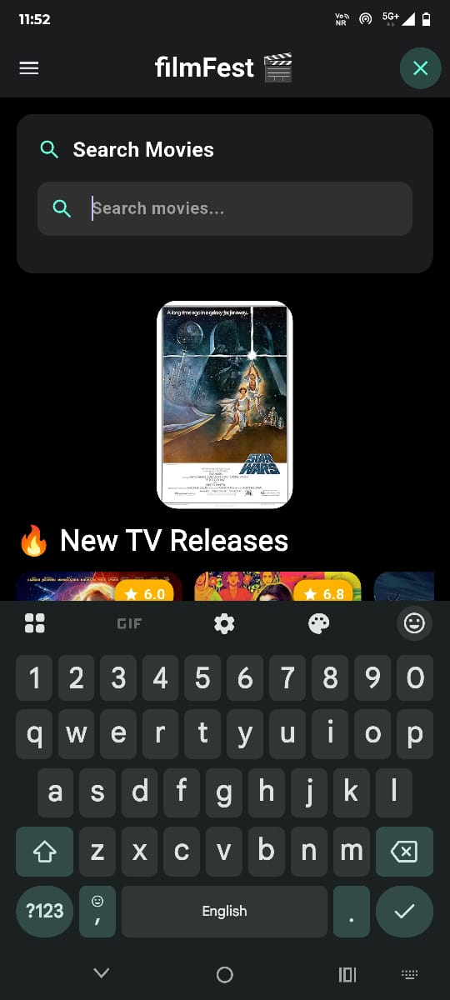
  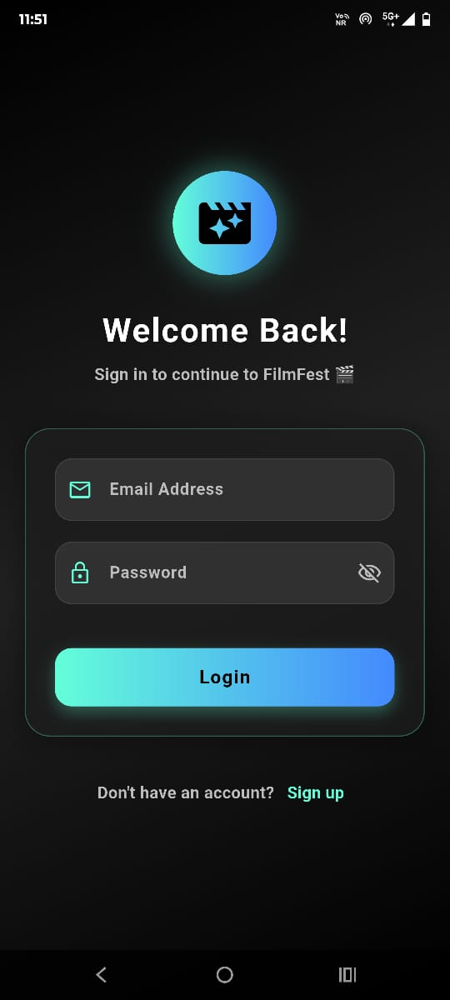
  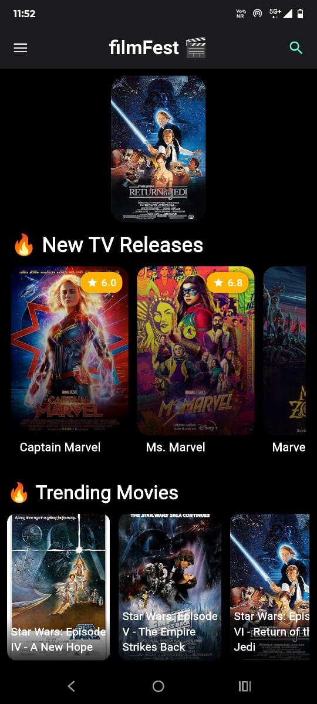
  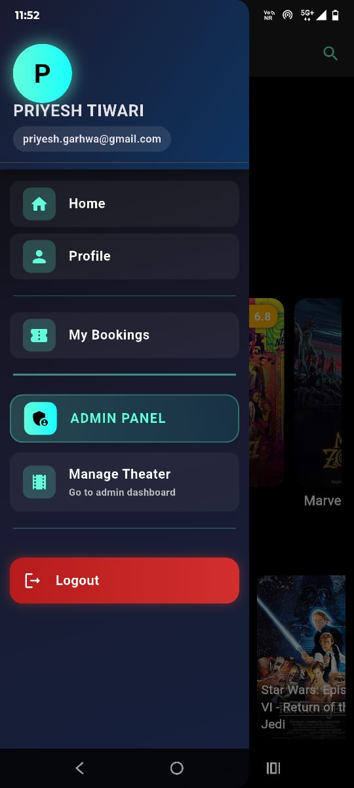
</p>

### Movie Browsing & Selection
<p align="center">
  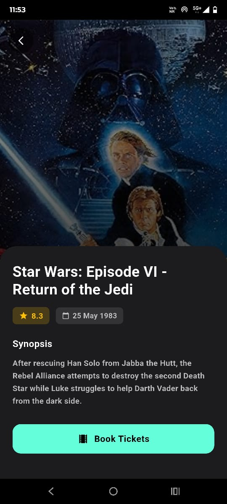
  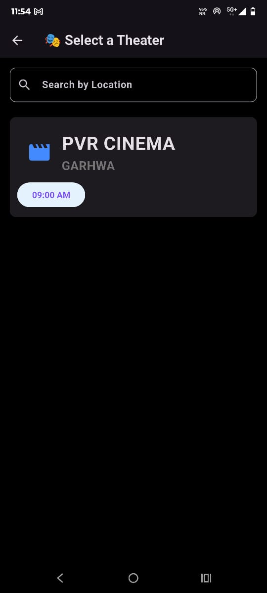
  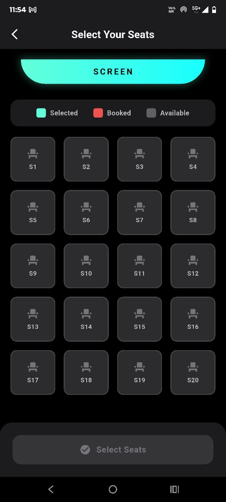
</p>

### Booking & Payment
<p align="center">
  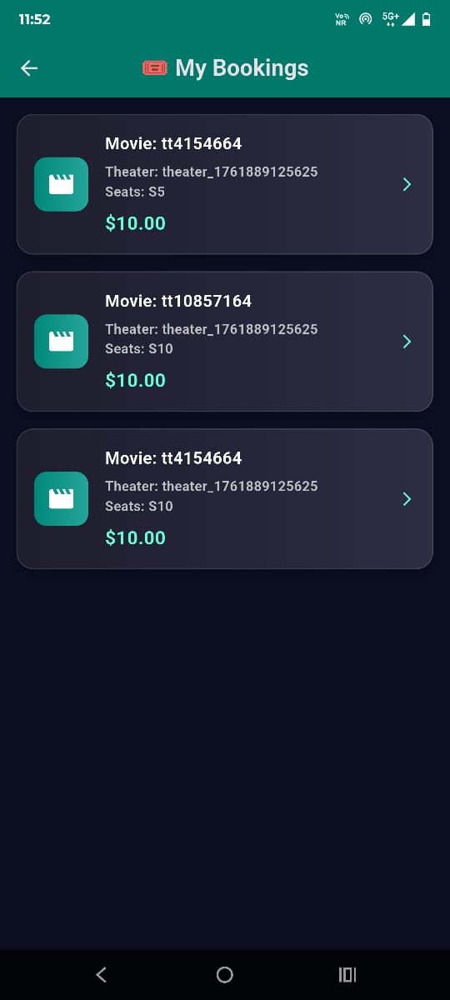
  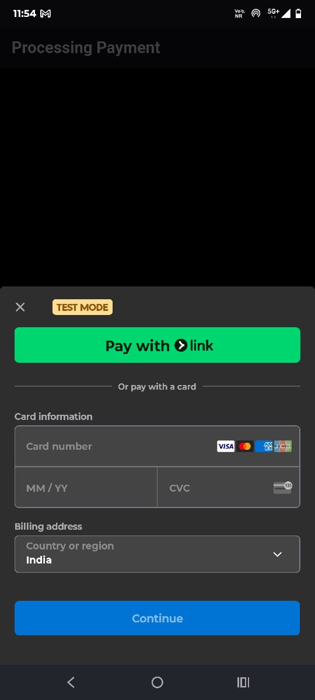
  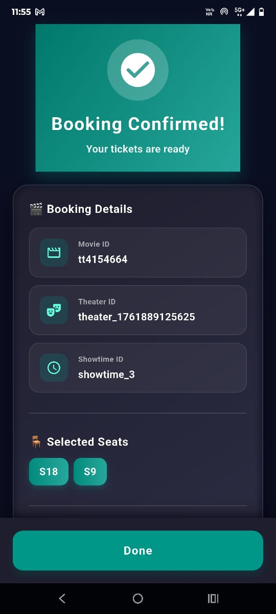
</p>

### Admin Features
<p align="center">
  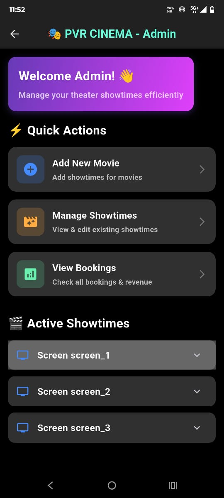
  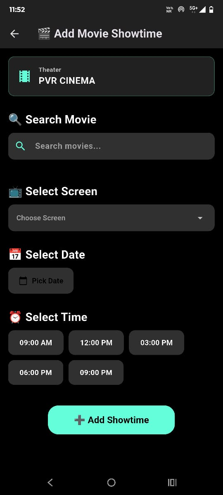
</p>

## 🏗️ Key Technical Implementations

### Real-time Seat Synchronization
- Firestore real-time listeners for instant seat status updates
- Optimistic concurrency control to prevent double-booking
- Conflict resolution for simultaneous booking attempts
- Automatic seat lock mechanism during selection

### Payment Integration
- Stripe SDK integration with secure token generation
- Webhook handling for payment confirmation
- Transaction verification and receipt generation
- Error handling and retry mechanisms

### API Integration
- RESTful API calls to TMDB/OMDB for live movie data
- Caching strategy for improved performance
- Error handling and fallback mechanisms
- Dynamic content updates

### Firebase Implementation
- Role-based access control (Admin vs Customer)
- Real-time data synchronization
- Efficient Firestore queries with proper indexing
- Security rules for data protection

## 🚀 Getting Started

### Prerequisites
- Flutter SDK (3.0 or higher)
- Dart SDK
- Android Studio or VS Code
- Firebase Account
- Stripe Account (for payment testing)
- TMDB API Key

### Installation

1. Clone the repository
```bash
git clone https://github.com/priyesh-tiwari/movie-ticket-booking.git
cd movie-ticket-booking
```

2. Install dependencies
```bash
flutter pub get
```

3. Configure Firebase
- Add `google-services.json` to `android/app/` (for Android)
- Add `GoogleService-Info.plist` to `ios/Runner/` (for iOS)

4. Configure API Keys
- Add your TMDB API key in the configuration file
- Set up Stripe publishable and secret keys

5. Set up Node.js backend (for Stripe)
```bash
cd backend
npm install
node server.js
```

6. Run the Flutter app
```bash
flutter run
```

## 📦 Key Dependencies
```yaml
firebase_core: ^x.x.x          # Firebase initialization
firebase_auth: ^x.x.x          # Authentication
cloud_firestore: ^x.x.x        # Real-time database
flutter_stripe: ^x.x.x         # Payment integration
http: ^x.x.x                   # REST API calls
provider: ^x.x.x               # State management
```

## 🎯 Project Structure
```
lib/
├── models/          # Data models
├── screens/         # UI screens
├── services/        # Firebase & API services
├── widgets/         # Reusable widgets
└── utils/           # Helper functions

backend/
├── server.js        # Node.js Stripe server
└── package.json     # Dependencies
```

## 👨‍💻 Developer

**Priyesh Tiwari**
- **GitHub:** [@priyesh-tiwari](https://github.com/priyesh-tiwari)
- **LinkedIn:** [priyesh-tiwari](https://linkedin.com/in/priyesh-tiwari)
- **Email:** priyesh.garhwa@gmail.com

**Education:** B.Tech in Computer Science & Engineering  
**Institution:** Birsa Institute of Technology, Sindri, Dhanbad, Jharkhand  
**CGPA:** 7.02/10.0

## 🏆 Achievements

- Solved 400+ Data Structures & Algorithms problems on LeetCode and GeeksforGeeks
- JEE Mains 2022: AIR 35,116 (96.104 percentile) among 1M+ candidates
- Certified: "Flutter & Dart – The Complete Guide [2025]" – Udemy

## 📝 License

This project is created for portfolio demonstration purposes.

## 🤝 Contributing

This is a portfolio project. Feel free to fork and modify for your learning purposes.

## 📧 Contact

For any queries or collaboration opportunities:
- Email: priyesh.garhwa@gmail.com
- LinkedIn: [Connect with me](https://linkedin.com/in/priyesh-tiwari)

---

⭐ **If you find this project useful, please consider giving it a star!**

💼 **Open to Flutter Development opportunities** | Available for immediate joining | Seeking internship/full-time roles
